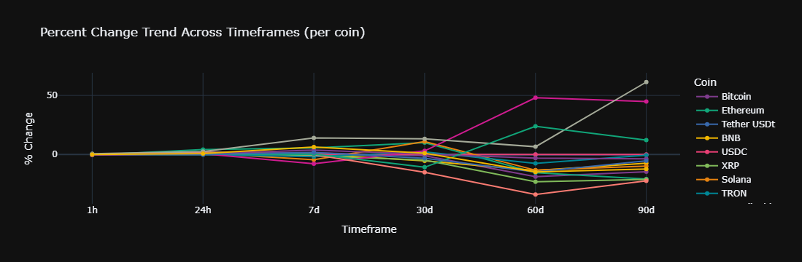
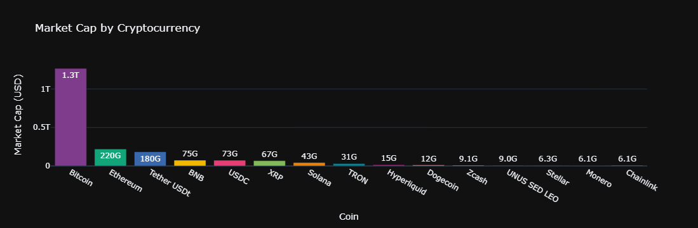
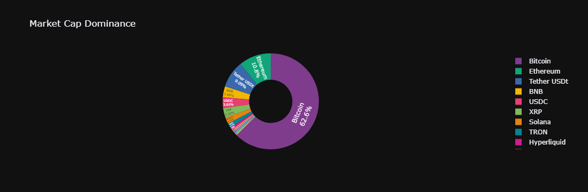
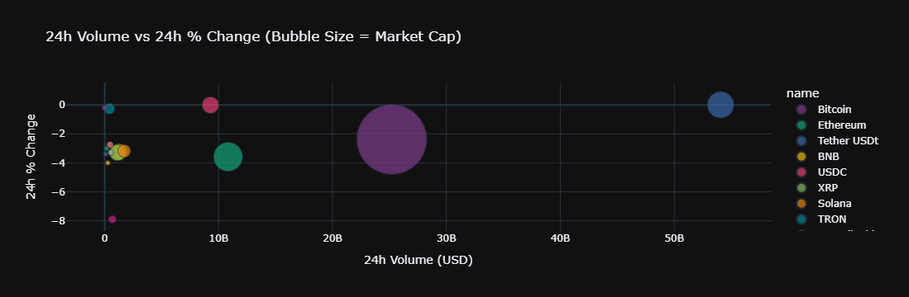
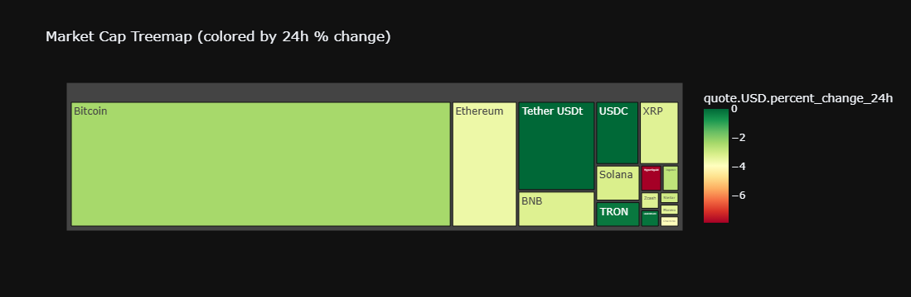
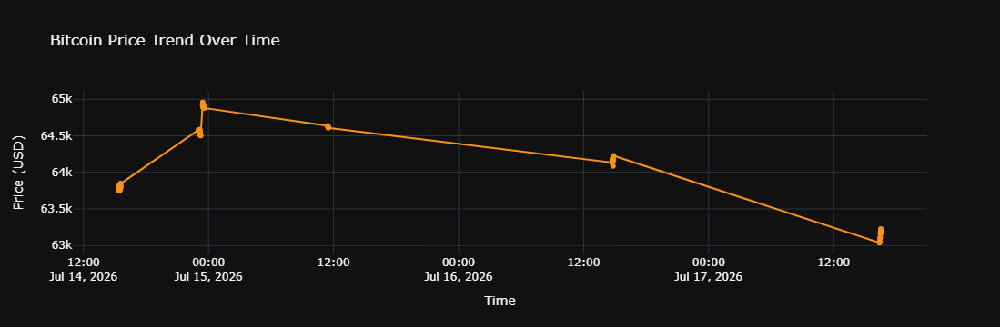
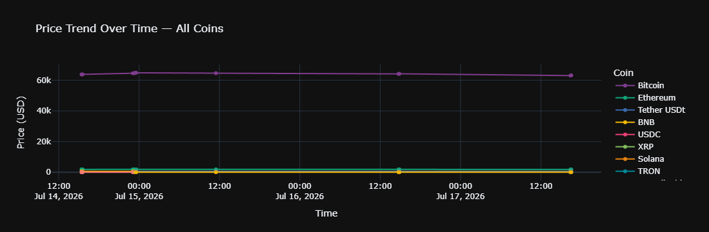
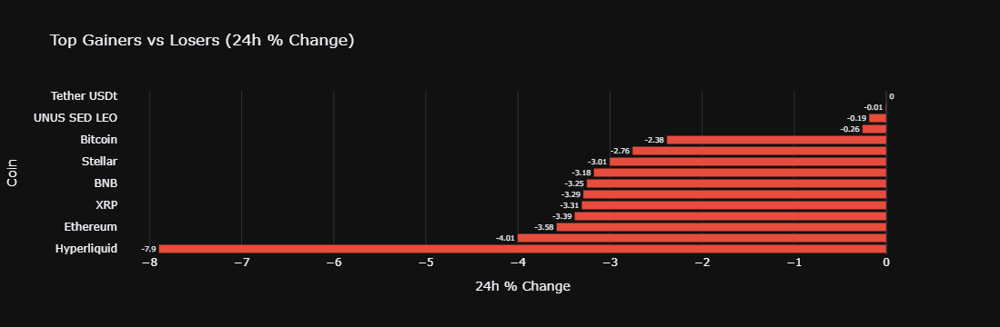

# 📊 Crypto Market Intelligence Dashboard

An end-to-end data pipeline that automates cryptocurrency market data collection from the **CoinMarketCap API**, builds a historical time-series dataset, and turns it into an interactive analytics dashboard covering 15 major cryptocurrencies - Bitcoin, Ethereum, Tether, BNB, USDC, XRP, Solana, TRON, Hyperliquid, Dogecoin, Zcash, UNUS SED LEO, Stellar, Monero, and Chainlink.

Built as a portfolio project to demonstrate practical **Data Analyst / Data Scientist** skills: API integration, automated data pipelines, data cleaning and transformation, and multi-format data visualization.

---

## 🎯 Why this project

Financial and crypto markets generate fast-moving, high-volume data — exactly the kind of environment London's fintech and trading firms work in daily. This project mirrors that workflow end to end:

- Pulling live data from a third-party REST API
- Handling rate limits, errors, and scheduled/automated collection
- Structuring nested JSON into clean, analysis-ready tables
- Deriving trend and momentum metrics across multiple timeframes (1h → 90d)
- Communicating findings through clear, decision-ready visuals

## 🛠️ Tech Stack

| Category | Tools |
|---|---|
| Language | Python 3 |
| Data handling | Pandas, NumPy |
| API / HTTP | Requests |
| Interactive visualization | Plotly (Express & Graph Objects) |
| Statistical visualization | Seaborn, Matplotlib |
| Environment | Jupyter Notebook |

## ✨ Features

- **Automated data collection** - scheduled API calls (configurable interval and run count) with error handling so a single failed request never breaks the pipeline
- **Growing historical dataset** - each run appends fresh data to a CSV, enabling genuine time-series analysis rather than a single snapshot
- **Trend analysis** - percent change aggregated and reshaped across six timeframes (1h, 24h, 7d, 30d, 60d, 90d) per coin
- **14 visualizations** spanning market structure, momentum, and price movement (see gallery below)

## 📁 Project Structure

```
crypto-market-intelligence-dashboard/
├── crypto-market-intelligence-dashboard.ipynb   # Main notebook
├── requirements.txt                              # Python dependencies
├── .gitignore                                    # Excludes API keys and raw data
├── README.md
├── screenshots/                                  # Chart gallery (below)
│   ├── 01_percent_change_trend.png
│   ├── 02_market_cap_bar_chart.png
│   ├── 03_market_cap_dominance.png
│   ├── 04_volume_bubble_chart.png
│   ├── 05_market_cap_treemap.png
│   ├── 06_bitcoin_price_trend.png
│   ├── 07_all_coins_price_trend.png
│   └── 08_top_gainers_losers.png
├── notebook_screenshots/                         # Full code + output walkthrough
└── sample_data/
    └── API.csv
```

## 🚀 Getting Started

### 1. Clone the repository
```bash
git clone https://github.com/vrut-data/crypto-market-intelligence-dashboard.git
cd crypto-market-intelligence-dashboard
```

### 2. Install dependencies
```bash
pip install -r requirements.txt
```

### 3. Get a free API key
Sign up at [pro.coinmarketcap.com/signup](https://pro.coinmarketcap.com/signup) for a free Basic plan API key.

### 4. Add your API key
Open `crypto-market-intelligence-dashboard.ipynb` and paste your key into the designated cell near the top:
```python
API_KEY = "YOUR_API_KEY_HERE"
```

### 5. Run the notebook
Run all cells top to bottom (Kernel → Restart & Run All).

---

## 📈 Chart Gallery

### Percent Change Trend Across Timeframes
Momentum for each coin from 1 hour out to 90 days, on one chart.



### Market Cap by Cryptocurrency
Bitcoin's absolute scale versus the rest of the top 15.



### Market Cap Dominance
Share of total market capitalization held by each coin.



### 24h Volume vs 24h % Change
Bubble size encodes market cap - reveals which coins combine high trading volume with strong price movement.



### Market Cap Treemap
Hierarchical view of market share, colored by 24h performance.



### Bitcoin Price Trend Over Time
Price movement tracked across each automated collection run.



### All Coins Price Trend Over Time
Multi-line comparison across the full collected dataset.



### Top Gainers vs Top Losers (24h)
Diverging bar chart highlighting the day's strongest and weakest performers.



---

## 📊 Sample Dataset

Data is pulled live from the `/v1/cryptocurrency/listings/latest` endpoint and normalized into a flat table with fields including:

`name`, `symbol`, `cmc_rank`, `circulating_supply`, `quote.USD.price`, `quote.USD.market_cap`, `quote.USD.volume_24h`, `quote.USD.percent_change_1h/24h/7d/30d/60d/90d`, `timestamp`

## 🔮 Future Improvements

- Migrate storage from CSV to a proper database (SQLite / PostgreSQL)
- Deploy as a live Streamlit dashboard
- Add price forecasting with a simple time-series model
- Automate scheduling with cron / GitHub Actions / Airflow
- Add unit tests for the data pipeline

## 📄 License

This project is open source and available under the MIT License.

## 👤 Author

**Vrutant** Data Analytics portfolio project.
Open to Data Analyst / Data Scientist opportunities in London.

[LinkedIn](https://www.linkedin.com/in/vrutantvaghela) · [GitHub](https://github.com/vrut-data)
